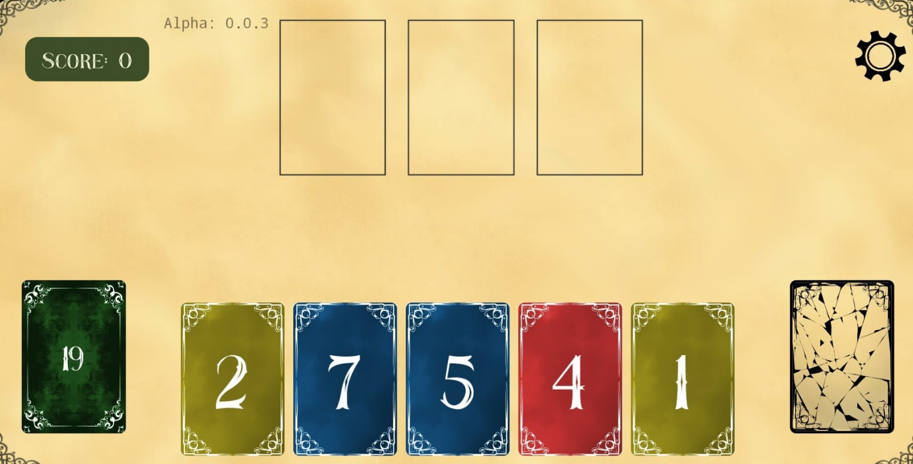
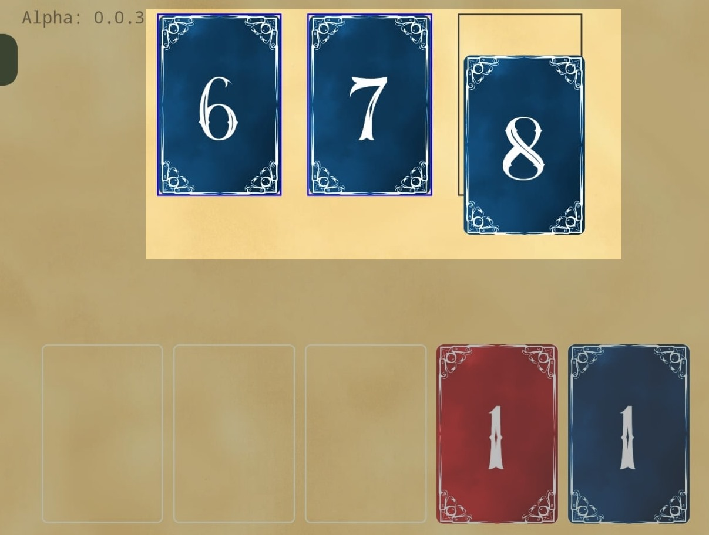
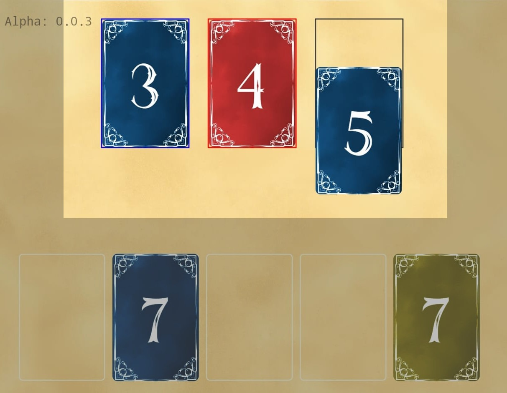
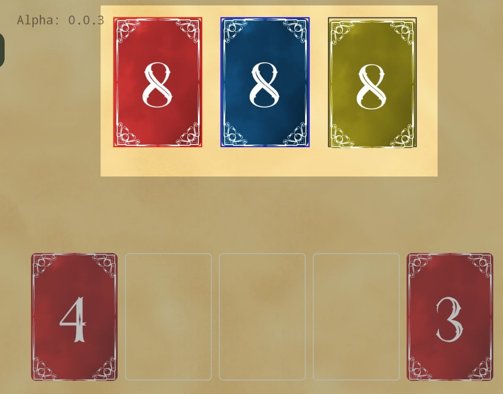
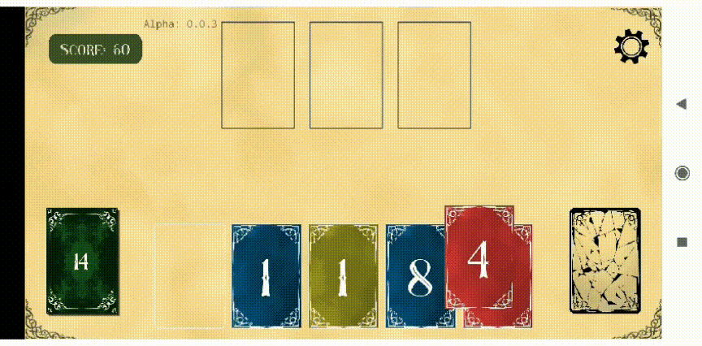
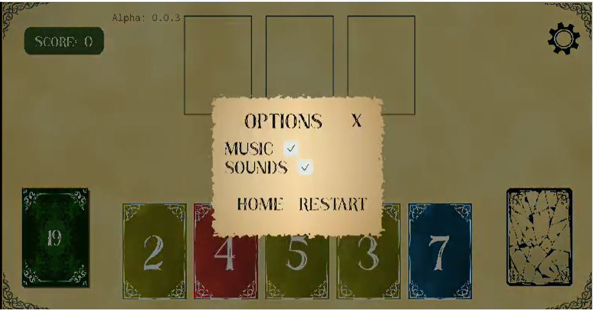

# Matching Card Game

Matching Cards Game is a fun and strategic card game where players match high-scoring cards to maximize their points. Sharpen your tactics and aim for the highest score!

## Version

0.0.3 (Latest Release)

## Features

- **Scoreboard**: Track your points in real-time as you progress.
- **User-Friendly Interface**: Designed for smooth and intuitive gameplay.
- **In-Game Audio Settings**: Customize your sound experience.
- **Online Leaderboard**: Compete with players globally (coming soon).

## Technologies

- **Framework**: Expo React Native
- **Programming Language**: Typescript
- **State Management**: Zustand
- **Backend**: Firebase (Upcoming)

## External Tools

**GIMP**: Used for asset editing and graphic design.
**Flux v1 Schnell AI with Compfy UI**: For generating game assets.
**Suno AI**: Provides dynamic and immersive gameplay music.

## Contact

- ismailsevgi95@gmail.com

## How To Play

## How to Play

1. **Start the Game**:
   At the beginning of the game, 5 cards are automatically drawn from a deck of 24 cards.
   
2. **Goal**:
   Arrange cards in sequences or match colors to score points. There are two primary ways to play:

   - **Sequence Play**: Line up cards in numerical order (e.g., 3-4-5) with the same or different colors. Sequences of the same color yield more points.
     
     
   - **Same Number Play**: Match three cards with the same number (e.g., 8-8-8) but with different colors for bonus points.
     

3. **Card Management**:
   - If you can’t play any valid moves, drag one card to the discard slot to remove it, and draw a new card from the deck.
     
4. **Sound Settings**:

   - You can easily adjust the game’s audio settings from the in-game options menu.
     

5. When there are no more card moves to be made in the game, a ranking table appears according to the points collected by the player.
6. The goal is to collect the most points with possible possibilities and rank at the top of the list.

That is all you need to know to play the game.
Good luck and have fun playing :)

## Download recent version 0.0.3

<a data-testid="artifact-download-button" download="matching-cards-0-0-3" type="button" href="https://expo.dev/artifacts/eas/n8LuMSnqGrufERSBUWzNsj.apk">
Latest Version
</a>

## Contact

For questions, suggestions, or feedback, feel free to reach out:

Email: ismailsevgi95@gmail.com

# Happy Gaming! 🎮
